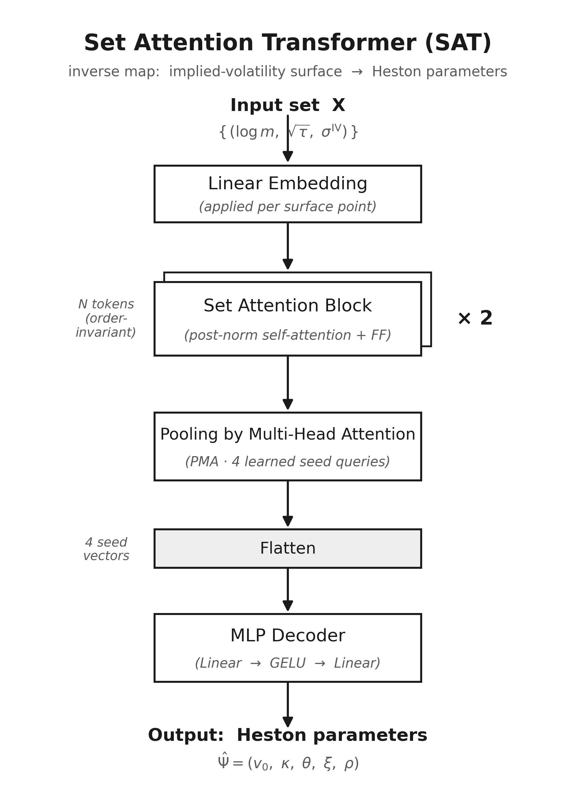
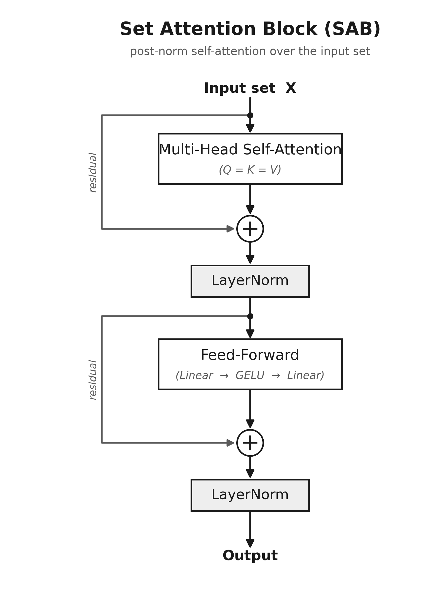
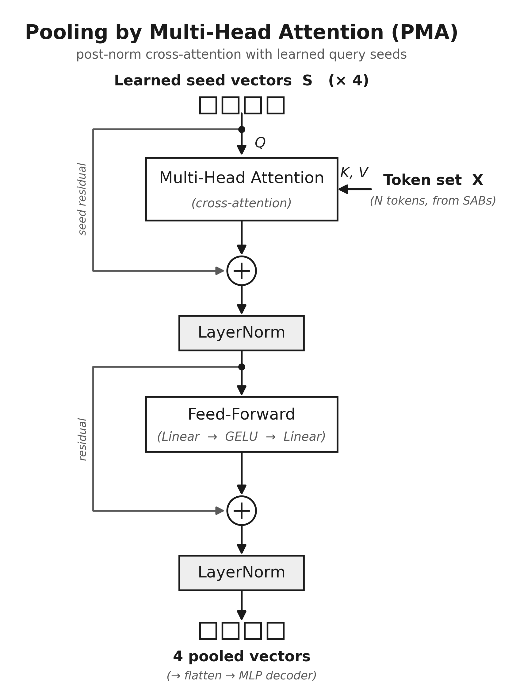

# Archietcture and Experiment Analysis

## Introduction and Motivation

The problem this project aims to solve is an optimal method the calibration of the Heston model. When we calibrate the Heston model we are trying to find the five values for these parameters that match the market dynamics as close as possible. Intuitively one would define a loss function between model prices and market prices and try to minimise it, the problem with this is that mapping from these parameters to option prices is extremely non-linear. This means that the loss function has an extremely complicated shape with many local minima, thus two very different parameterisation can produce almost identical prices. Classic optimisers work iteritevaly, first guess some parameters, then compute the loss, then adjust the parameters and repeat until it converges, which requires significant computation. The Machine Learning approach sidesteps this problem entirely. We do all the expensive computation once at training time and then at inference we can just do a single forward pass of the model, which is just a fixed sequence of matrix operations.

Mathematically, a volatility surface is simply a set of $(K, T, \sigma)$ triples, there is no canonical ordering. Thus, the function that our machine learning model will attempt to approximate will be a permutation invariant function acting on sets. We define these terms as following:

A function acting on sets is a map

$$
f : 2^X \to Y,
$$

where $2^X$ denotes the power set of $X$.

A function $f : 2^X \to Y$ acting on sets is permutation invariant if, for any permutation $\pi$,

$$
f(\{x_1,\ldots,x_M\}) = f(\{x_{\pi(1)},\ldots,x_{\pi(M)}\}).
$$

It can be further demonstrated that a function $f : 2^X \to Y$ acting on sets is permutation invariant if and only if it can be decomposed as

$$
f(X) = \rho\left(\sum_{x \in X} \phi(x)\right),
$$

for suitable transformations $\phi$ and $\rho$, which in the machine learning context will usually be an encoder ($\phi$), and a decoder ($\rho$) which are composed of several layers.

For these reasons we propose a variant of the Set Transformer for this problem, where the encoder and decoder functions are:

$$\phi(X) = SAB(SAB(X))$$

$$\rho(Z) = rFF(PMA_{4}(Z))$$

Where SAB is a set attention block layer, $PMA_{4}$ is a pooling by multi-head attention layer with 4 seed vectors, rFF is a feedforward network. We will now explicate the function of these layers.

## The Set Transformer

  

  

  

## Baselines and Ablations

## Training and Evaluation

## Experiment Results

### Table 1 - Headline accuracy: Set Transformer vs Multi-Layer Perceptron

| Model | Params | Seed | MAE | R² |
|---|---:|---:|---:|---:|
| SAT (PMA, 2 SAB) | 142,405 | 0 | 0.0289 | 0.9941 |
| SAT (PMA, 2 SAB) | 142,405 | 1 | 0.0338 | 0.9930 |
| **SAT (PMA, 2 SAB) mean** | 142,405 | — | **0.0313 ± 0.0035** | **0.9935 ± 0.0008** |
| MLP (baseline) | 351,493 | 0 | 0.0953 | 0.9525 |
| MLP (baseline) | 351,493 | 1 | 0.0549 | 0.9804 |
| **MLP (baseline) mean** | 351,493 | — | **0.0751 ± 0.0286** | **0.9665 ± 0.0197** |

### Table 2 - Ablation architectures

| Model | Params | MAE (mean ± sd) | R² (mean ± sd) |
|---|---:|---:|---:|
| SAT (full reference) | 142,405 | 0.0313 ± 0.0035 | 0.9935 ± 0.0008 |
| SAT w/o PMA (mean pool) | 84,101 | 0.0323 ± 0.0069 | 0.9926 ± 0.0028 |
| SAT w/o SAB (embed→PMA) | 75,461 | 0.0407 ± 0.0005 | 0.9857 ± 0.0030 |
| Transformer + pos. enc. | 150,405 | 0.0420 ± 0.0097 | 0.9877 ± 0.0018 |
| 2D CNN (15×8 grid) | 225,541 | 0.0401 ± 0.0104 | 0.9866 ± 0.0045 |

### Table 3 - Permutation invariance confirmation

Max |Δprediction| over 10 random point-permutations of 200 test surfaces, confirming the permutation invariance of the set transformer.

| Model | Seed 0 | Seed 1 |
|---|---:|---:|
| SAT | 2.08e–05 = 0.0000208 | 2.41e–05 = 0.0000241|
| MLP | 6.42e+01 = 64.2 | 2.17e+01 = 21.7 |

## Robustness Experiments

  

  

## Surface Reconstruction

  

## Discussion
