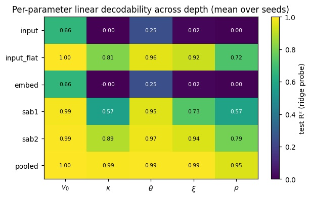

# Interpretability Analysis

## Linear Probe Classifiers

The primary idea behind Linear Probe Classifiers is to take layer-wise intermediate representations in some model, and train a linear classifier to attempt to decode some property of interest. The primary goal of such probes is to identify the models creation of "computationally useful" representations, for example the collection of pixel values in some image may be a visually useful representation of the content of the image, but not a computationally useful representation of the image. Continuing the prior example we could think of a neural net that attempts to classify some fact regarding the image as a model that takes the "visually useful" pixel values of the image, converts them into "computationally useful" representations, and then uses these represntations to classify the image. From an information theory perspective, we can look at this approach as attempting to estimate mutual information between an intermediate representation in the model and some property,

In this project we use ridge regression classifiers to probe our model at each layer, attempting to identify when the various parameter values are decodable, hoping to gain some insight into at what stage of the model "computationally useful" represntations of the features of the volatility surface emerge.

## Sparse Autoencoders and Feature Decomposition

If we want to reverse engineer a deep neural network, it seems necessary that we must break it down into smaller parts (so-called features) that we can look at in isolation to the rest of the model.

A key challenge when doing this is the emergent property of neural networks is **polysemanticity**, a property where neurons in a network are activated by seemingly unrelated features. The **linearity theory** suggests that models encode information as directions in the activation space, a seemingly intuitive property. If we heuristically decompose the loss function into 2 parts, the benefit a model gets from encoded some features and the amount that features representation interfers with the other operations of the model, we can begin to understand why this property emerges:

$$
L \sim
\underbrace{\sum_i I_i \left(1 - \|W_i\|^2\right)^2}_{\text{Feature Benefit}}
+
\underbrace{\sum_{i \neq j} I_j \left(W_j \cdot W_i\right)^2}_{\text{Interference}}
$$

$I_i$ is the importance of feature i, $W_i$ is the vector representation of feature i.

The **superposition theory** indicates that since a vector space can only have as many orthogonal vectors as it does dimensions, due to the sparsity (rare occurance) of most features the network learns an over-complete basis of "almost orthogonal" features. This can be thought of as the network noisily simulating a much larger network, as because of the sparsity of most features the benefit of encoding these features is greater than the loss caused by these activations interfering with other features.

This motivates the use of **sparse autoencoders** to decompose the activation vectors into a combination of more general fearures. Take some activation vector $x^{j}$, we desire to decompose it into a linear combination

$$
x^{(j)} \approx b + \sum_i f_i\!\left(x^{(j)}\right)d_i
$$

Where the $f_{i}$ are the individual features, which we acquire by using an autoencoder with an additional L1 term in the loss function to encourage sparsity, to map the activation vector into a higher dimensional space, and then attempt reconstruct the origanal activation vector using this higher dimensional representation. The loss function of the sparse autoencoder is given by:

$$
L(x) = \underbrace{\|x-\hat{x}\|^2}_{\text{reconstruction loss}} + \underbrace{\lambda \|c\|_1}_{\text{sparsity loss}}$$

Where c is the activation value of the feature. In our experiments we use $\lambda = 0.005$, and encode the activation vectore using a linear layer and ReLU activation, so the features $f_{i}$ are in the form:

$$f_{i}(x) = ReLU((x - b_{decoder})W_{encoder} + b_{encoder})$$

## Experiment Results and Discussion

  

